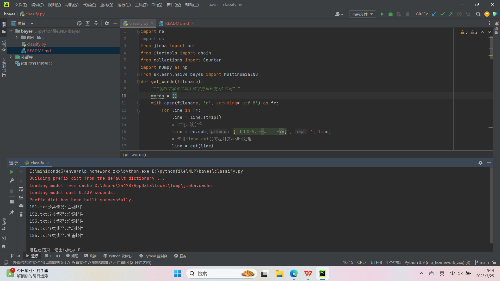
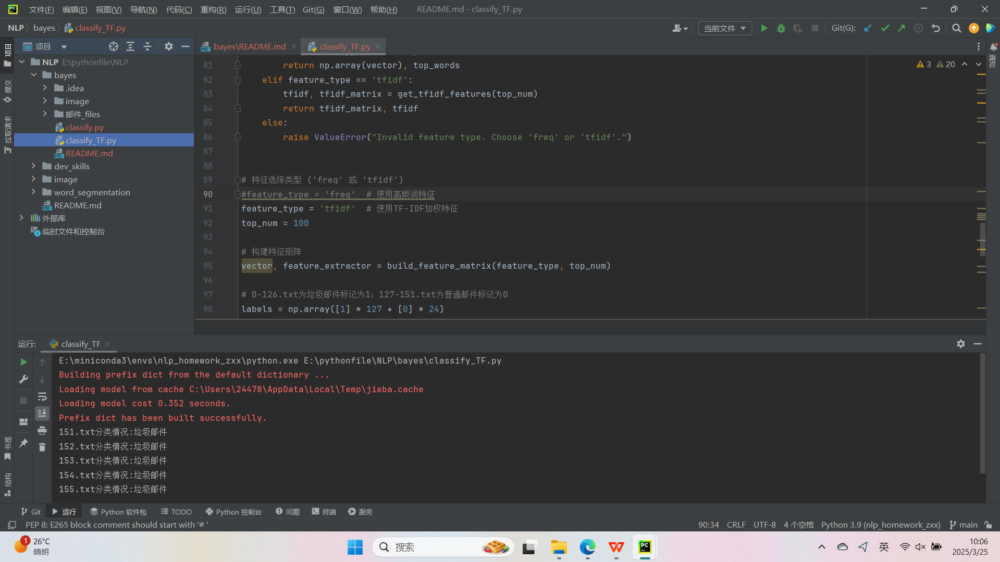
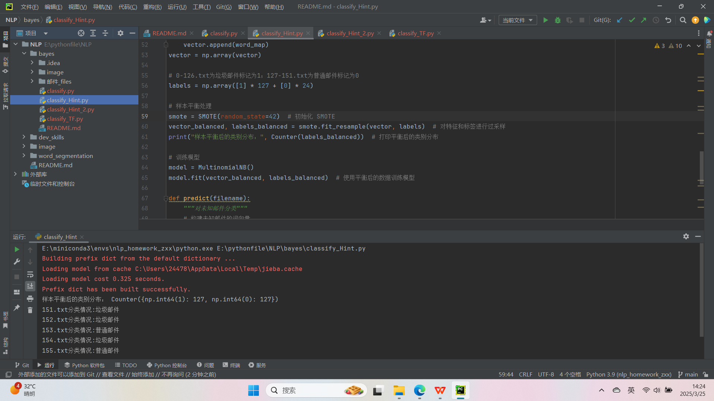
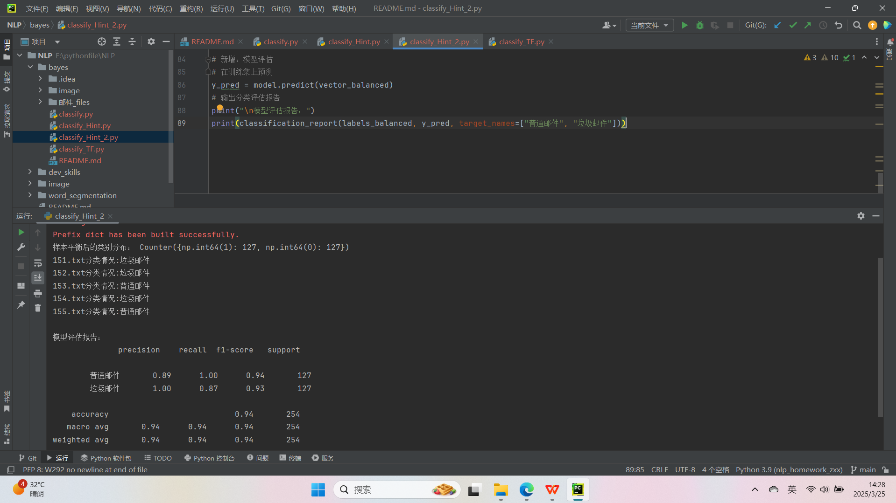

# 邮件分类项目

本项目实现了一个基于多项式朴素贝叶斯分类器的邮件分类系统，支持高频词特征和TF-IDF加权特征两种特征选择模式。通过参数化切换机制，用户可以根据需求灵活选择特征提取方式。

## 代码核心功能说明

### 算法基础
本项目采用**多项式朴素贝叶斯分类器**（Multinomial Naive Bayes），其核心思想是基于贝叶斯定理和条件概率的特征独立性假设。

- **贝叶斯定理**：在邮件分类中，贝叶斯定理用于计算给定邮件内容条件下邮件属于某一类别的概率。
- **特征独立性假设**：多项式朴素贝叶斯假设邮件中的每个词（特征）是相互独立的。

### 数据处理流程
1. **分词处理**：使用 `jieba` 库对邮件内容进行分词，将文本切分为独立的词语。
2. **停用词过滤**：通过正则表达式过滤无效字符（如标点符号、数字等），并去除长度为1的词。
3. **文本清理**：去除无关字符，保留有效词语，确保数据质量。

### 特征构建过程
本项目支持两种特征提取方式：
1. **高频词特征选择**：
   - 统计所有邮件中出现频率最高的词，构建词频向量。
   - 实现方式：使用 `collections.Counter` 统计词频，选择前 `top_num` 个高频词。

2. **TF-IDF加权特征**：
   - 计算每个词的TF-IDF值，衡量词在邮件中的重要性。
   - 实现方式：使用 `sklearn.feature_extraction.text.TfidfVectorizer` 计算TF-IDF值。

### 高频词/TF-IDF两种特征模式的切换方法
在代码中，通过设置 `feature_type` 参数选择特征提取方式：
- 设置为 `'freq'` 时，使用高频词特征。
- 设置为 `'tfidf'` 时，使用TF-IDF加权特征。

示例：
```python
feature_type = 'freq'  # 使用高频词特征
# feature_type = 'tfidf'  # 使用TF-IDF加权特征
```
### 代码运行截图
`classify.py`



`classsify_TF.py`



## optional
### 样本平衡处理
`classify_Hint.py`



### 增加模型评估指标
`classify_Hint_2.py`

