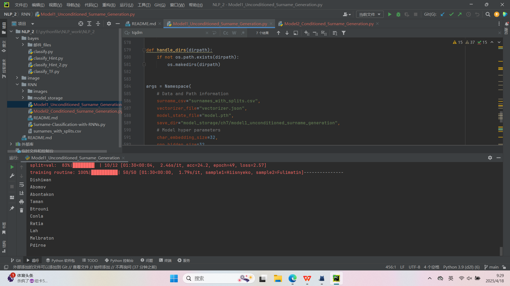

# 数据预处理验证

# 模型结构验证

# RNN序列处理验证

# 模型性能评估

# 推理能力验证

# 无条件姓氏生成
`Model1_Unconditioned_Surname_Generation.py`

# 有条件姓氏生成
`Model2_Conditioned_Surname_Generation.py`

# 回答问题
① 两个模型的核心差异体现在什么机制上？

B. 是否考虑国家信息作为生成条件

---

② 在条件生成模型`Model2_Conditioned_Surname_Generation`中，国家信息通过什么方式影响生成过程？

B. 作为GRU的初始隐藏状态

---

③ 文件2中新增的nation_emb层的主要作用是：

`self.nation_emb = nn.Embedding(num_nationalities, rnn_hidden_size)`

B. 将国家标签转换为隐藏状态初始化向量

---

④ 对比两个文件的sample_from_model函数，文件2新增了哪个关键参数？

B. nationalities